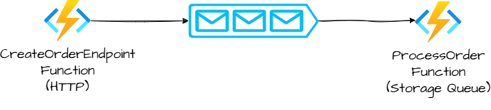
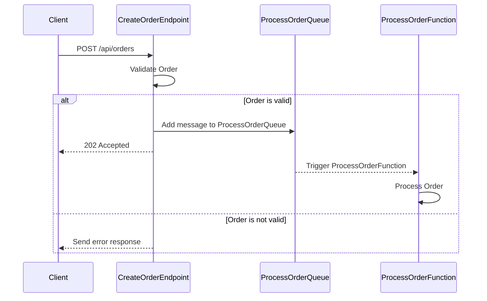

# Testing Azure Functions

## :medal_military: Context
This article provides an opinionated approach to testing Azure functions (isolated worker model).
The approach taken here is using containerized dependencies and XUnit as the test framework.

## :zap: What Features in Azure Functions are Tested?

Mostly used features in Azure functions are their trigger types and bindings.
In this article, we will cover the following features.

* Different Azure function triggers
  * HTTP Trigger
  * Azure storage queue trigger
  * Azure service bus trigger

* Azure Bindings    
  * Output binding to Azure storage queue

## :construction_worker: Testing Output Binding to Azure Storage Queue

* A "create order" request is sent to an HTTP endpoint. The endpoint validates the order, and if the order is valid, 
it publishes a message to a storage queue.
  * Publishing to the queue is done through an output binding.


* A storage queue trigger function is triggered when a message is enqueued to the queue.
The function reads the message from the queue and processes the order.






## :construction_worker_woman: Testing Service bus queue trigger

The function is triggered when a message is enqueued to the service bus queue, and it will log the message.

We could extend this further by including another integration such as a database, but to keep it more targeted towards
the purpose of this article, we'll keep it simple.

## :thinking: Why Containers?

When working with Azure functions, for local development and testing, the recommended approach
is to use Azurite as an emulator for Azure storage. So either you can use Azurite as a container 
or install it using npm.

My personal preference is to use containers simply because it's straightforward to set up and tear down, 
and the ability to run multiple instances of the same image.

Also, Azure functions can be deployed and run as a container.

By using `TestContainers.Net` Nuget package, we can create containers for testing at runtime, and dispose of them 
after the tests are completed.

So theoretically, we should be able to closely simulate the actual environment in Azure.

By following up on that theory, we'll need to create the below containers.

* Azurite container for Azure storage
* Azure Service Bus container for service bus
  * Service bus container internally uses an MSSql container, so we'll need to create that as well
* The actual Azure function container where the code runs

So all these container pieces should be able to work together to simulate the actual environment to run the Azure functions.

## :link: How do the containers communicate with each other?

Containers are isolated and secure by not allowing any external access to the container.

In this approach, we use a few different containers, and they need to communicate with each other.
We do this by creating a user-defined network and attaching the containers to that network.

## Required configurations for the function app to run

When running locally, we can configure the function settings in the `local.settings.json` file.

But when running in a container, we need to set these settings as environment variables.

Below is the list of configurations required to run the function app.

| Setting Name                          | Description                                                            |
|---------------------------------------|------------------------------------------------------------------------|
| StorageConfig__ProcessingQueueName    | The name of the queue where the create order message will be published |
| ServiceBusConfig__ProcessingQueueName | The name of the service bus queue                                      |
| AzureWebJobsQueueConnection           | Connection string for the Azure storage account (Azurite)              |
| AzureWebJobsAsbConnection             | Connection string for the Azure service bus (Service bus container)    |


## :whale: Creating the container for the Azure function

Let's create a `Docker` file, which will be used to create the container for the Azure function.

```dockerfile

FROM mcr.microsoft.com/azure-functions/dotnet-isolated:4-dotnet-isolated8.0 AS base
WORKDIR /home/site/wwwroot
EXPOSE 80

FROM mcr.microsoft.com/dotnet/sdk:8.0 AS build
ARG BUILD_CONFIGURATION=Release
WORKDIR /src
COPY . .
RUN dotnet publish "./OrderProcessorFuncApp.csproj" -c $BUILD_CONFIGURATION -o /app/publish /p:UseAppHost=false

FROM base AS final
WORKDIR /home/site/wwwroot
COPY --from=build /app/publish .
ENV AzureFunctionsJobHost__Logging__Console__IsEnabled=true
```

The .NET8 SDK is used to build the project, and create the published artifact.
Then this artifact is copied to the Azure functions base image.

Finally, set the environment variable to enable console logging.
This is important because otherwise, we won't be able to see any logs in the test output, and these logs
will be used to assert the function execution in the tests.

The rest of the environment variables will be set when creating the container in the test fixture.

## :sparkles: XUnit Fixtures

To separate the container setup and teardown logic from the actual tests, we will use XUnit fixtures.

To categorize all tests into one collection, we will use a collection fixture called `IsolatedFunctionsTestFixture`.

1. Create a `Network` container
2. Create an `Azurite` container and attach it to the network
3. Create an `MSSql` container and attach it to the network
4. Create a `ServiceBus` container using the MSSql container, and also attach it to the network
5. Create the `FunctionApp` image using the `Dockerfile` created earlier, and use it to create a
   the function app container and attach it to the network
6. When creating the function app container, configure all the environment variables for the function app to connect
   to the Azurite and Service bus containers

Let's go through the code which does the above steps.

### Creating the Network

```csharp
var network = new NetworkBuilder().Build();
await network.CreateAsync();
```

### Creating the MSSql Container

```csharp
private static (MsSqlContainer Container, string Password) GetMSSqlContainer(INetwork network)
{
    var dbPassword = $"pwd{RandomNumberGenerator.GetHexString(6)}-666";
    var sqlContainer = new MsSqlBuilder()
        .WithPassword(dbPassword)
        .WithNetwork(network)
        .WithNetworkAliases("db")
        .WithAutoRemove(true)
        .WithWaitStrategy(Wait.ForUnixContainer().UntilInternalTcpPortIsAvailable(MsSqlBuilder.MsSqlPort))
        .Build();
    return (sqlContainer, dbPassword);
}
```

We need to alias the network to `db` because the service bus container will use this alias to connect to the database.

### Creating the Service Bus Container

```csharp
private static ServiceBusContainer SetupServiceBusContainer(
    INetwork network,
    MsSqlContainer sqlContainer,
    string dbPassword,
    string serviceBusConfigFullPath
)
{
    var serviceBus = new ServiceBusBuilder()
        .WithMsSqlContainer(network, sqlContainer, SqlServerAlias, dbPassword)
        .WithNetworkAliases(ServiceBusAlias)
        .WithAutoRemove(true)
        .WithPortBinding(ServiceBusBuilder.ServiceBusPort, assignRandomHostPort: true) // AMQP port
        .WithPortBinding(ServiceBusBuilder.ServiceBusHttpPort, assignRandomHostPort: true) // HTTP port
        .WithBindMount(serviceBusConfigFullPath, "/ServiceBus_Emulator/ConfigFiles/Config.json")
        .WithEnvironment("ACCEPT_EULA", "Y")
        .WithEnvironment("SQL_SERVER", SqlServerAlias)
        .WithEnvironment("MSSQL_SA_PASSWORD", dbPassword)
        .WithWaitStrategy(Wait.ForUnixContainer().UntilMessageIsLogged("Emulator Service is Successfully Up"))
        .Build();
    return serviceBus;
}
```    

The service bus container internally uses the MSSql container, and it uses the network alias `db` to connect to the database.
Also the service bus container uses its own alias, so it'll be used in the connection string to connect to the service bus in the 
function app.

### Creating the Azurite Container

```csharp
private static async Task<AzuriteContainer> SetupAzuriteContainer(INetwork network, params string[] queueNames)
{
    var container = new AzuriteBuilder()
        .WithImage("mcr.microsoft.com/azure-storage/azurite")
        .WithNetwork(network)
        .WithNetworkAliases(AzuriteAlias)
        .WithAutoRemove(true)
        .WithPortBinding(10000, assignRandomHostPort: true) // Blob service
        .WithPortBinding(10001, assignRandomHostPort: true) // Queue service
        .WithPortBinding(10002, assignRandomHostPort: true) // Table service
        .Build();

    await container.StartAsync();

    var qsClient = new QueueServiceClient(
        container.GetConnectionString(),
        new QueueClientOptions { MessageEncoding = QueueMessageEncoding.Base64 }
    );
    foreach (var queueName in queueNames)
    {
        await qsClient.GetQueueClient(queueName).CreateIfNotExistsAsync();
    }

    return container;
}
```

Azurite container uses its own alias, so it'll be used in the connection string to connect to the storage account in the 
function app.

Note that in here, we are also creating the queues in Azurite that will be used in the function app.

### Creating the Function App Container

```csharp

private async Task<IContainer> SetupFunctionContainer(
        string dockerfileDirectory,
        INetwork network,
        AzuriteContainer azuriteContainer,
        ServiceBusContainer serviceBusContainer
    )
    {
        // Creating the function image from the Dockerfile
        _functionImage = new ImageFromDockerfileBuilder()
            .WithDockerfileDirectory(CommonDirectoryPath.GetSolutionDirectory(), dockerfileDirectory)
            .WithCleanUp(true)
            .Build();

        await _functionImage.CreateAsync();

        var azuriteBlobPort = azuriteContainer.GetMappedPublicPort(AzuriteBuilder.BlobPort);
        var azuriteQueuePort = azuriteContainer.GetMappedPublicPort(AzuriteBuilder.QueuePort);
        var azuriteTablePort = azuriteContainer.GetMappedPublicPort(AzuriteBuilder.TablePort);
        var dnsAzuriteConnectionString = azuriteContainer
            .GetConnectionString()
            .Replace(azuriteContainer.Hostname, AzuriteAlias)
            .Replace(azuriteBlobPort.ToString(), AzuriteBuilder.BlobPort.ToString())
            .Replace(azuriteQueuePort.ToString(), AzuriteBuilder.QueuePort.ToString())
            .Replace(azuriteTablePort.ToString(), AzuriteBuilder.TablePort.ToString());

        var hostServiceBusPort = serviceBusContainer.GetMappedPublicPort(ServiceBusBuilder.ServiceBusPort);
        var hostHttpPort = serviceBusContainer.GetMappedPublicPort(ServiceBusBuilder.ServiceBusHttpPort);
        var dnsServiceBusConnectionString = serviceBusContainer
            .GetConnectionString()
            .Replace(_serviceBusContainer.Hostname, ServiceBusAlias)
            .Replace(hostServiceBusPort.ToString(), ServiceBusBuilder.ServiceBusPort.ToString())
            .Replace(hostHttpPort.ToString(), ServiceBusBuilder.ServiceBusHttpPort.ToString());

        var container = new ContainerBuilder()
            .WithImage(_functionImage)
            .WithNetwork(network)
            .WithAutoRemove(true)
            .WithEnvironment("AzureWebJobsStorage", dnsAzuriteConnectionString)
            .WithEnvironment("AzureWebJobsQueueConnection", dnsAzuriteConnectionString)
            .WithEnvironment("AzureWebJobsAsbConnection", dnsServiceBusConnectionString)
            .WithEnvironment("AZURE_FUNCTIONS_ENVIRONMENT", "Development")
            .WithEnvironment("StorageConfig__ProcessingQueueName", "processing-queue")
            .WithEnvironment("ServiceBusConfig__ProcessingQueueName", "temp-orders")
            .WithPortBinding(80, assignRandomHostPort: true)
            .WithWaitStrategy(Wait.ForUnixContainer().UntilInternalTcpPortIsAvailable(80).UntilMessageIsLogged("Application started"))
            .Build();

        return container;
    }

```

Firstly, we use the Docker file created earlier to create the function image, then we create the function container using that image,
and attach it to the network.

Notice the `dnsAzuriteConnectionString` and `dnsServiceBusConnectionString` variables. The internal connection between the containers 
happens through the network aliases, so the function container needs to use those aliases to connect to the Azurite and Service bus containers.

Finally, we set the required configurations using environment variables.
This is done using the `WithEnvironment` method.

## Why two test classes with the same tests?

There are two test classes `OrderProcessorIntegrationTests` and `AnotherOrderProcessorIntegrationTests`, and yes
couldn't come up with a better name :).

Both these classes have the same tests, but that's to demonstrate that multiple containers can be created 
and run independently.

## :book: Notes

### Using Managed Identity vs Connection Strings

In a production environment, it's recommended to use managed identity to connect to Azure resources securely.
But when testing locally through this approach, you cannot use managed identity because the function app is running 
in a container and does not use any Azure Entra.

An approach you could take is to use an environment variable to switch between managed identity and connection strings.
The [recommended](https://learn.microsoft.com/en-us/azure/azure-functions/functions-app-settings#azure_functions_environment) variable to use is `AZURE_FUNCTIONS_ENVIRONMENT`.
When running in Azure, this variable is set to `Production`, and when running locally, it's set to `Development`.
Then in the code, configure connectivity to Azure resources conditionally based on the value of this variable.

### Why not use ServiceBusAdministrationClient to Provision Service Bus Resources?

We use TestContainers.ServiceBus to create the Azure Service Bus emulator container.

By design, the emulator does not support management operations, according to the [official documentation](https://learn.microsoft.com/en-us/azure/service-bus-messaging/overview-emulator#known-limitations).

* In the Azure Service Bus Emulator, it only supports data plane operations such as sending and receiving messages
* It does not support management operations such as creating queues, topics, or subscriptions
* So to create the service bus resources, you need to use a configuration file,
  * [Interact with the emulator using a configuration file](https://learn.microsoft.com/en-us/azure/service-bus-messaging/test-locally-with-service-bus-emulator?tabs=automated-script#interact-with-the-emulator) 

### Installing Azurite

Follow this [link](https://learn.microsoft.com/en-us/azure/storage/common/storage-install-azurite?toc=%2Fazure%2Fstorage%2Fblobs%2Ftoc.json&bc=%2Fazure%2Fstorage%2Fblobs%2Fbreadcrumb%2Ftoc.json&tabs=visual-studio%2Cblob-storage) for installation instructions.