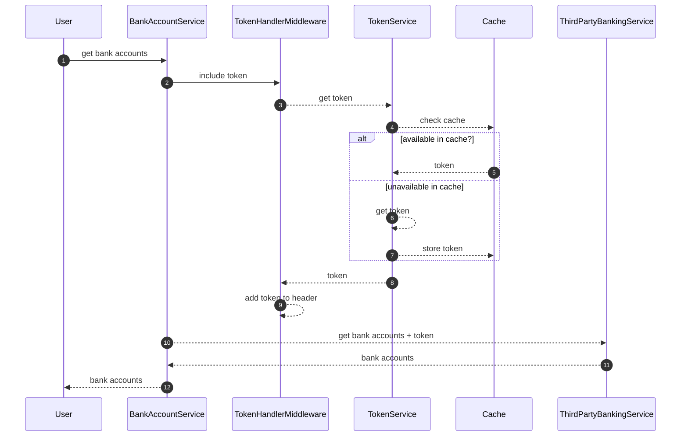

# Resilient HTTP Clients

## Context

Resiliency is a key aspect of modern software development, especially when dealing with external services.
This project demonstrates how to build resilient HTTP clients using various patterns and techniques.

We will explore the `microsoft.extensions.http.resilience` library, which provide mechanisms for handling
transient faults and ensuring that our application can gracefully recover from failures.

Let's list down what we will explore in this illustration:
* A user requests bank accounts from a third party banking service
* The third party service requires a token for authentication
* Using a cache to store the token for a certain period of time
* The third party can purge the active tokens at any time
  * Once the token is purged, you'll need to invalidate the token in your cache because the token is no longer valid

## Designing Resiliency

Designing resiliency does not mean just retrying, it means you need to design your resiliency to be specific and 
tailored to your need.

In here, the most important part of this integration is where the third party can invalidate the token at any time.
The problem happens when we have a valid token which is cached. 
By default, the cache will not be invalidated until the expiration time, and until then we will keep getting an 
unauthorized response from the third party service.

To solve this problem, we need to design our resiliency in a way that we can detect when to invalidate the token, 
get a new one and use it in consecutive requests.

## Technical Design



## Components

### ResiliencePipeline

This is a pipeline that will be used to define the resiliency logic.
The benefit of completely separating the resiliency logic from other components is that you can reuse with 
any other component as you see fit.

```csharp
services.AddResiliencePipeline<string, HttpResponseMessage>(
    "pipeline",
    (builder, context) =>
    {
        var sp = context.ServiceProvider;
        builder.AddRetry(
            new HttpRetryStrategyOptions
            {
                MaxRetryAttempts = 1,
                BackoffType = DelayBackoffType.Linear,
                Delay = TimeSpan.FromSeconds(1),
                ShouldHandle = args =>
                    args.Outcome.Result
                        is {
                            StatusCode: HttpStatusCode.Forbidden
                                or HttpStatusCode.Unauthorized
                        }
                        ? PredicateResult.True()
                        : PredicateResult.False(),
                OnRetry = async arguments =>
                {
                    var cacheService = sp.GetRequiredService<ITokenService>();
                    await cacheService.GetTokenAsync(
                        arguments.Context.CancellationToken,
                        true
                    );
                },
            }
        );
    }
);
```

Let's break down the above code:

* It only retries once when the response is `Forbidden` or `Unauthorized`
* `OnRetry` it will call the `TokenService` to get a new token
* It uses a linear backoff strategy with a delay of 1 second
* The resiliency pipeline/strategy is named as `pipeline`. By naming your pipelines, you can create as much as 
you want and reuse them in different components.
* The pipeline is registered with its associated expected output type

### BankAccountService

This is a typed HTTP client that integrates with the third party banking service.
Also, this is where we will use the resiliency logic.

```csharp
public interface IBankAccountService
{
    Task<ListBankAccountsResponse> ListBankAccountsAsync(CancellationToken token);
}

internal sealed class BankAccountService(
    HttpClient client,
    ResiliencePipelineProvider<string> pipelineProvider,
    ILogger<BankAccountService> logger
) : IBankAccountService
{
    public async Task<ListBankAccountsResponse> ListBankAccountsAsync(CancellationToken token)
    {
        var policy = pipelineProvider.GetPipeline<HttpResponseMessage>("pipeline");

        var httpResponse = await policy.ExecuteAsync(
            async ct => await client.GetAsync("/api/accounts", ct),
            token
        );

        var bankAccounts = await httpResponse.Content.ReadFromJsonAsync<ListBankAccountsResponse>(
            token
        );
        return bankAccounts ?? ListBankAccountsResponse.Empty;
    }
}
```

The ResiliencePipelineProvider is injected into the `BankAccountService` client, and through that it can 
get the required pipeline by name.

Now we wrap the API call with the resiliency pipeline.

This will ensure that;
* If the response is `Forbidden` or `Unauthorized`, the resiliency strategy is applied as defined in the pipeline
* The whole API call will be retried again once, which will use the new token

As you can see the `BankAccountService` client is completely separated from the resiliency logic and contains only
the business logic of calling the third party service.

#### Why is the resiliency applied in BankAccountService?

Simply because it depends on "how and when" you want to apply the resiliency logic. 
According to our scenario explained above, we want to handle token invalidation from the third party service at 
any given time. 
This can be known only, when the third party service returns `Forbidden` or an `Unauthorized` response, and then only 
we could apply resiliency.

### TokenHandlerMiddleware

This is a middleware that will be used to add the token to the request header.
This middleware will be used in the `BankAccountService` client.
The reason to do this is to separate the concerns of including a token in the header of each request 
sent through the `BacnkAccountService`.

### TokenService

Another typed HTTP client which involves the token generation and caching it.
It integrates with the `Cache` to store the token for a certain period of time.
If the token is available, it will be used, otherwise a new token will be generated and stored in the cache.

### Cache

In here we will use the `microsoft.extensions.caching.memory` library to cache the token.
Depending on your needs, you can use other caching libraries like `microsoft.extensions.caching.redis` 
or `microsoft.extensions.caching.sqlserver`.

## Why not use `HttpClient`s `AddResiliencyHandler` for this?

With latest versions in `microsoft.extensions.http.client` you can add resiliency handlers to your HTTP client using
`AddResiliencyHandler`.

You can use this in scenarios where you need to perform a retry with some logic,
but the problem with it is as designed, **it will reuse the same `HTTPRequest` in your consecutive requests.**
This is not going to work in our situation because we need the new token to be included in the header of the request.

Let's explore the below code which adds resiliency to the `HttpClient`:

```csharp
services
    .AddHttpClient<IBankAccountService, OtherBankAccountService>()
    .ConfigureHttpClient(builder => builder.BaseAddress = new Uri(baseUrl))
    .AddHttpMessageHandler<TokenHeaderMiddleware>() // register the token middleware
    .AddResilienceHandler( // register the resiliency handler
        "pipeline",
        (builder, context) =>
        {
            var sp = context.ServiceProvider;
            builder.AddRetry(
                new HttpRetryStrategyOptions
                {
                    MaxRetryAttempts = 1,
                    BackoffType = DelayBackoffType.Linear,
                    Delay = TimeSpan.FromSeconds(1),
                    ShouldHandle = args => // retry only on unauthorized or forbidden
                        args.Outcome.Result is { StatusCode: HttpStatusCode.Unauthorized }
                            ? PredicateResult.True()
                            : PredicateResult.False(),
                    OnRetry = async arguments => // on retry, get a new token
                    {
                        var cacheService = sp.GetRequiredService<ITokenService>();
                        await cacheService.GetTokenAsync(arguments.Context.CancellationToken, true);
                    },
                }
            );
        }
    );
```

We have a test case implemented which simulates the problem. In there we assert whether a new token was included in
the header, and the test fails because the same request is reused with the old token.

Please refer [Test2](tests/ResilientHttpClients.Services.Tests/BankAccountServiceTests.cs) which illustrates this.

Read the next section how we can test this.

## Testing

Our main focus in this article is to test the resiliency, and the best way to test this is through integration tests.

Main nuget packages used for testing:

* `WireMock.Net` for mocking the third party service
* `BunsenBurner` for writing beautifully organized tests
* `AutoBogus` for generating realistic test data

### Handling different scenarios with WireMock.Net

When using WireMock.Net, you can create stateful scenarios to test different cases. This is crucial for our testing
because we need to return different responses to simulate the resiliency.


